# Skin Disease Chatbot using NLP and Machine Learning

A chatbot that reads a skin problem written in plain English, asks short follow-up questions when unsure, and suggests the closest match among 10 common skin conditions.

> **Academic project. Not medical advice. It does not diagnose.** Every answer says to see a dermatologist.

---

## Contents

[Summary](#1-summary) · [Architecture](#2-architecture) · [Run it](#3-run-it) · [Dataset](#4-dataset) · [Preprocessing](#5-preprocessing) · [Model and results](#6-model-and-results) · [Training curves](#7-training-curves) · [Conversation engine](#8-conversation-engine) · [Follow-up questions](#9-follow-up-questions) · [Safety](#10-safety) · [Limitations](#11-limitations) · [Professor Q&A](#12-professor-qa)

---

## 1. Summary

| | |
|---|---|
| Task | Classify a symptom message into 1 of 10 skin conditions, inside a chatbot |
| Classes | acne, eczema, psoriasis, ringworm, vitiligo, rosacea, contact dermatitis, hives, seborrheic dermatitis, scabies |
| Data | 2,486 messages (about 250 per class) |
| Features | TF-IDF, 1-2 word n-grams, 8,000 features |
| Model | Logistic Regression (C = 10) |
| Accuracy | **82.1%** test, 81.5% cross-validation |
| Top-3 accuracy | **97.2%** |
| With follow-up questions | **97.4%** (simulated, 1.14 questions per chat) |
| Runs on | A laptop, no GPU, no external API |

**Core idea:** one guess is right about 8 times in 10, but the right answer is in the top 3 about 97% of the time. So when the model is unsure, the bot asks a question that separates the top candidates.

---

## 2. Architecture

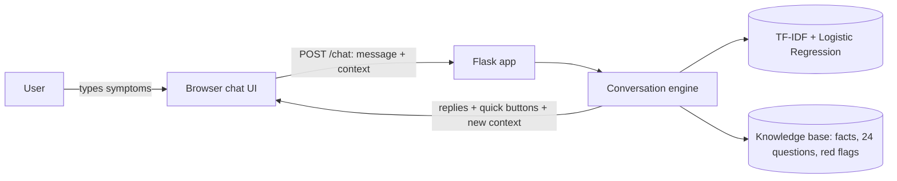

**Stateless server:** the browser sends the whole conversation state with every message. Nothing is stored on the server.

### Machine learning pipeline

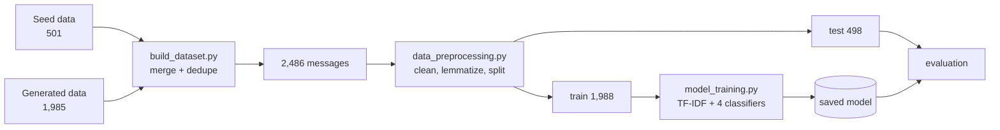

---

## 3. Run it

```bash
pip install -r requirements.txt
python app.py                      # open http://127.0.0.1:5000
```

Rebuild everything from scratch:

```bash
python src/build_dataset.py        # merge and de-duplicate data
python src/data_preprocessing.py   # clean text, split train/test
python src/model_training.py       # train, compare, save best model
python src/make_figures.py         # regenerate every figure below
python tests/simulate.py           # follow-up question simulation
```

Notebook with the same steps: `notebooks/skin_disease_chatbot.ipynb`.

<details>
<summary>Project structure</summary>

```
nlp/
|-- app.py                     Flask server, POST /chat
|-- requirements.txt
|-- src/
|   |-- build_dataset.py       merge + dedupe data
|   |-- data_preprocessing.py  cleaning, lemmatizing, split
|   |-- model_training.py      train and compare models
|   |-- make_figures.py        generates docs/figures
|   |-- chat_engine.py         dialogue engine
|   `-- knowledge.py           disease facts, questions, red flags
|-- data/raw/                  seed, generated, merged dataset
|-- data/processed/            train.csv, test.csv, label_mapping.csv
|-- models/                    model, labels, word purity table
|-- templates/ static/         chat web page
|-- docs/figures/              all charts
|-- notebooks/                 step-by-step notebook
`-- tests/                     simulation and demo scripts
```
</details>

---

## 4. Dataset

**Why not a public dataset?** None has free-text symptom messages labelled with these 10 diseases.

| Source | Type | Usable? |
|---|---|---|
| UCI Dermatology | 34 numeric clinical scores, 6 diseases | No, structured numbers not text |
| Kaggle image sets (HAM10000, ISIC) | Photos | No, wrong input type |
| Kaggle / Hugging Face medical text | General medicine, short keyword lists | Rarely skin-specific |
| **Built for this project** | Free-text messages with labels | **Yes** |

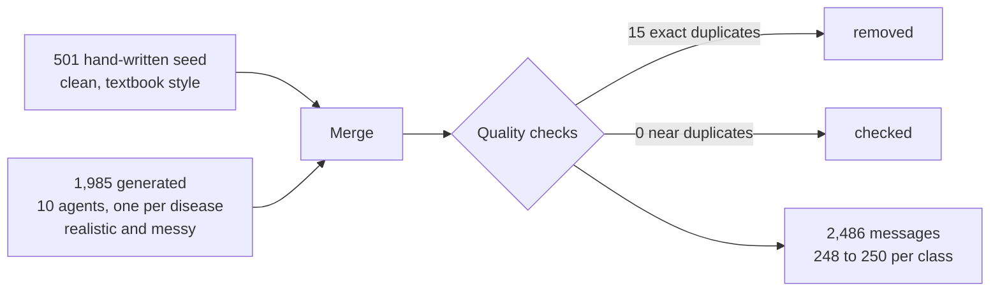

**Style mix requested for generated messages**

| Share | Style |
|---|---|
| 25% | Short fragments ("itchy flaky scalp since march") |
| 35% | One conversational sentence |
| 25% | Long, with duration, trigger, what they tried, age |
| 10% | Sloppy: lowercase, typos, non-native English |
| 5% | Questions |
| 15% | Vague or atypical, still correctly labelled |

Also varied by body location, age (baby to elderly) and skin tone. Fewer than 5% name the diagnosis.

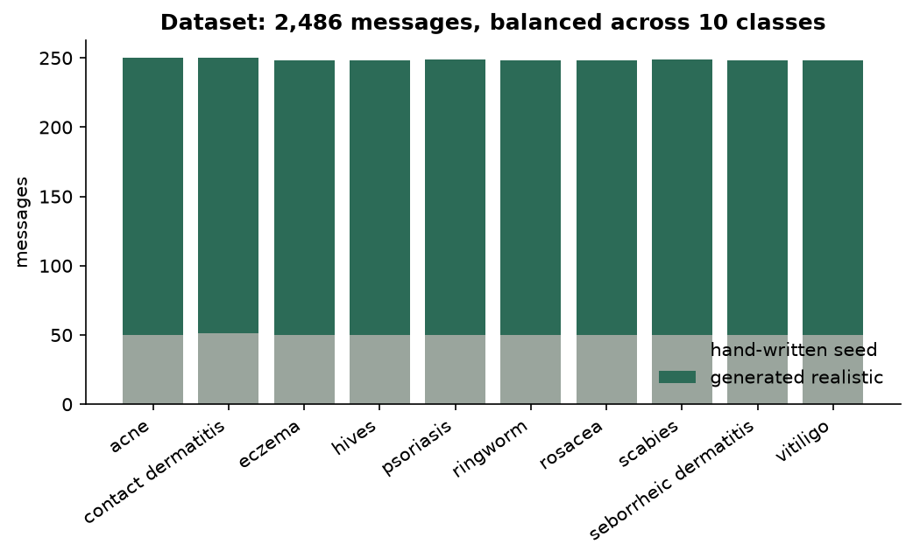

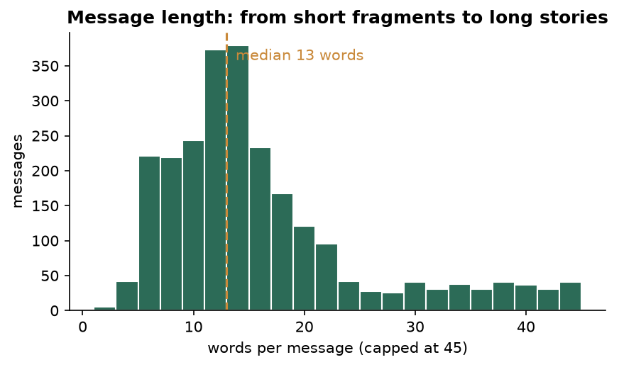

> **Honest note:** the data is synthetic, not from real patients.

---

## 5. Preprocessing

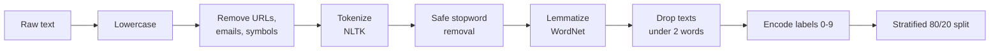

| Raw | Processed |
|---|---|
| I have itchy red patches on my elbows and knees that keep coming back | `itchy red patch elbow knee keep coming back` |
| Little red bumps showed up around my waist and the itch is way worse once I lie down | `little red bump showed around waist itch way worse lie` |

**Deliberately not removed** (they carry medical meaning)

| Kept | Why |
|---|---|
| not, no, without, never | "not itchy" is not "itchy" |
| after, during, between, very, more | "after eating" suggests hives, "between fingers" suggests scabies |
| colours, body parts, numbers | Core symptom information |
| Stemming avoided | Lemmatization is gentler |

---

## 6. Model and results

TF-IDF scores a word higher when it is frequent in the message and rare overall. Bigrams catch phrases like "ring shaped" and "between fingers".

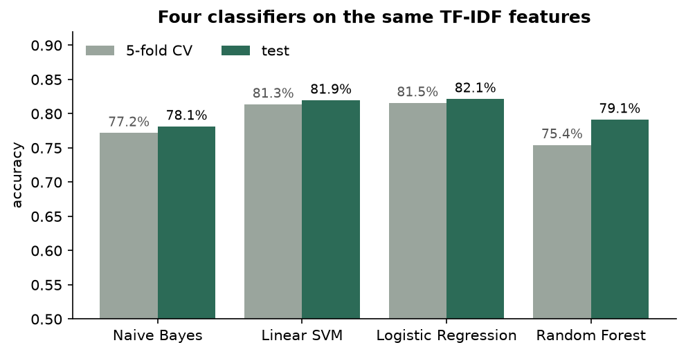

| Model | CV | Test |
|---|---|---|
| Naive Bayes | 77.2% | 78.1% |
| Linear SVM | 81.3% | 81.9% |
| **Logistic Regression** | **81.5%** | **82.1%** |
| Random Forest | 75.4% | 79.1% |

**Why Logistic Regression:** SVM is equally accurate but gives no probabilities. The follow-up logic needs probabilities.

### Confusion matrix

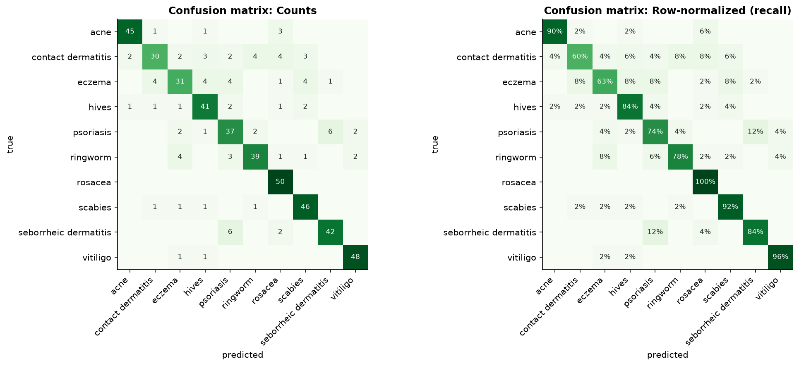

Most mistakes are between look-alike conditions: **psoriasis and seborrheic dermatitis** (12 swaps), and **eczema, contact dermatitis and psoriasis**. Rosacea (100%), vitiligo (96%) and scabies (92%) have distinctive wording.

### Per-class metrics

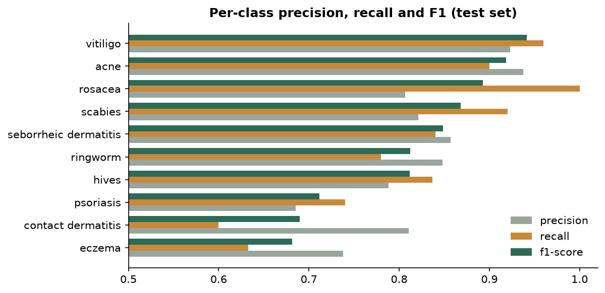

### Top-k accuracy

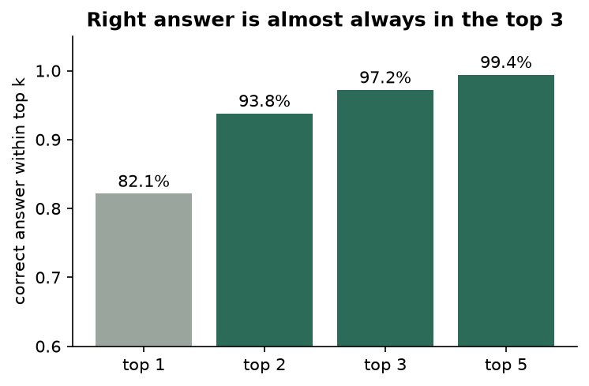

| Top 1 | Top 2 | Top 3 | Top 5 |
|---|---|---|---|
| 82.1% | 93.8% | 97.2% | 99.4% |

### What the model learned

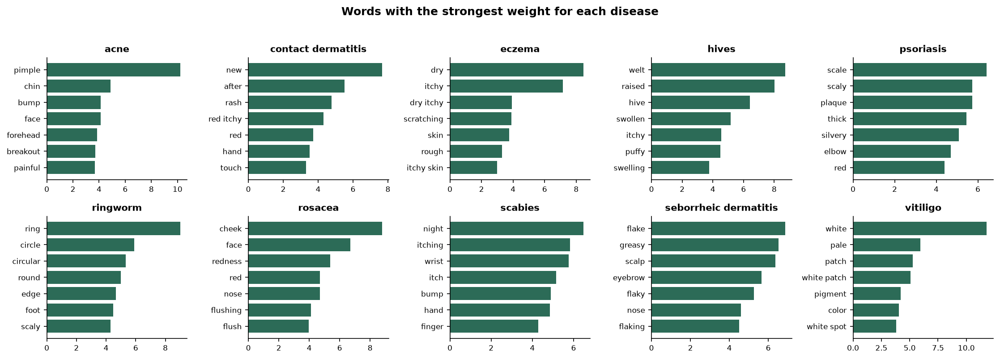

The weights make sense medically: *pimple* (acne), *ring, circular* (ringworm), *welt, raised* (hives), *night, wrist, finger* (scabies), *white, pale* (vitiligo).

---

## 7. Training curves

### Loss and accuracy per epoch

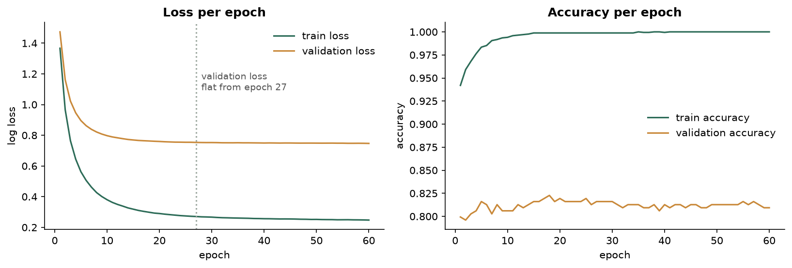

- The saved model uses the L-BFGS solver, which has no epochs. This curve trains the **same model family** (logistic regression) with SGD so convergence per epoch can be shown.
- A validation slice is held out of the training data. The test set is not used here.
- **Validation loss is flat from epoch 27.** Training accuracy reaches 100% while validation stays near 81%, a visible train/validation gap: the model fits the training text more closely than new text.

### Learning curve

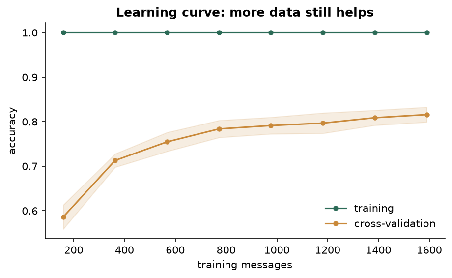

Validation accuracy rises from 58.6% with 10% of the training data to 81.6% with all of it, and has not fully flattened, so **more data would still help**.

### Regularization and confidence

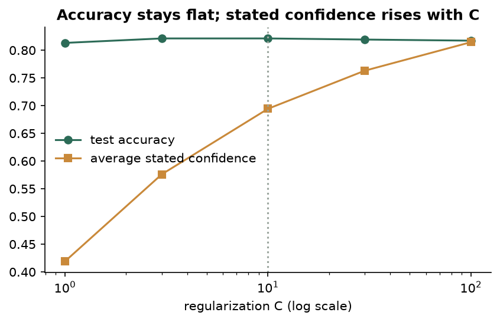

Accuracy is flat across C from 3 to 100. Stated confidence rises with C. C = 10 had the best cross-validation score, so it was chosen.

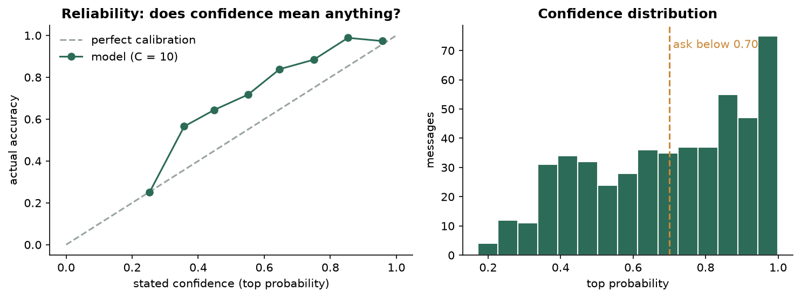

At C = 10 the model is slightly **underconfident** (average stated confidence 0.69, real accuracy 0.82). That is the safer direction for a health tool: it asks a question sooner rather than overclaiming.

---

## 8. Conversation engine

How every message is handled:

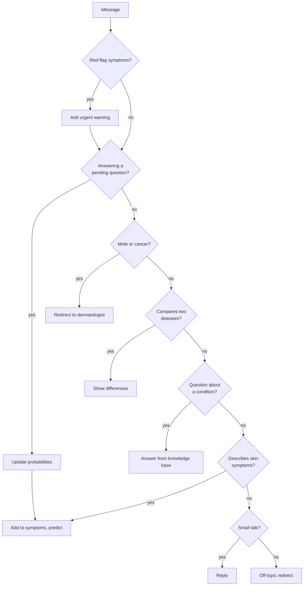

**Understanding messy input**

| Problem | Fix |
|---|---|
| Typos ("pimpls") | Match to closest known word |
| Slang ("zits", "scratchy", "my kid") | Small synonym table |
| Negation ("not red, no bumps") | Drop the negated word, since bag-of-words cannot read "not" |
| Off-topic ("my head hurts") | Skin-term list, also checked after spell fix |
| Disease name in a sentence | Remove names; if skin symptoms remain it is a description, else a knowledge question |

**Handles:** greetings, thanks, "who are you", "what can you do", "is eczema contagious?", "difference between eczema and psoriasis", "just tell me".

---

## 9. Follow-up questions

### Ask or answer?

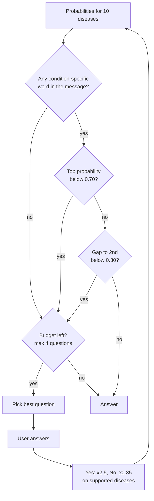

### Choosing the question

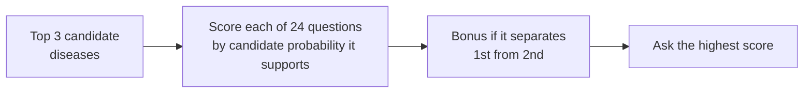

| Example question | A "yes" supports |
|---|---|
| Is the itching much worse at night? | scabies, eczema |
| Is the rash ring-shaped with a clearer center? | ringworm |
| Thick silvery-white scales on red patches? | psoriasis |
| Started after touching something new? | contact dermatitis |
| Do the welts come and go within hours? | hives |
| Does your face flush with heat or alcohol? | rosacea |

### Example conversation

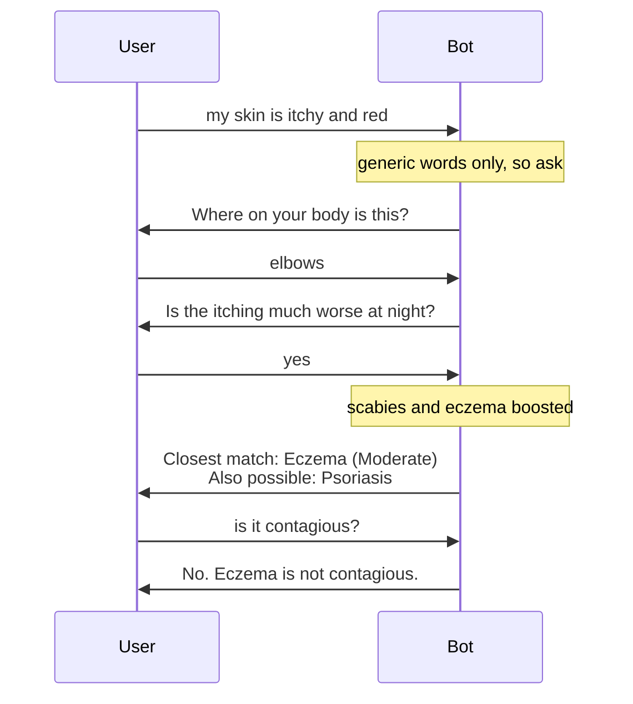

### Confidence labels

| Top probability | Label |
|---|---|
| 0.65 or more | Strong match |
| 0.40 to 0.65 | Moderate match |
| below 0.40 | Weak match |

Messages with no condition-specific word are capped at Weak, with one at Moderate. Other diseases at 0.15 or more (max 2) are shown as "Also possible".

### Measured effect (simulation on the test set)

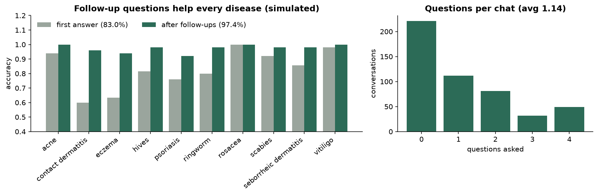

| Measure | Result |
|---|---|
| First answer accuracy | 83.0% |
| After follow-up questions | **97.4%** |
| Average questions per chat | 1.14 |
| Chats needing 0 / 1 / 2 / 3 / 4 questions | 221 / 112 / 81 / 32 / 49 |
| Messages understood | 495 of 498 |

Biggest gains: **contact dermatitis 60% to 96%**, **eczema 63% to 94%**. Simulated users always answer correctly, so treat this as an upper estimate.

---

## 10. Safety

| Safeguard | Detail |
|---|---|
| Disclaimers | Header, greeting, input area, every result |
| Honest confidence | Strong / Moderate / Weak plus alternatives |
| Urgent symptoms | Breathing trouble, swelling of lips or throat, fever with rash, skin peeling in sheets, spreading redness, fainting trigger a "get care now" warning |
| Moles and cancer | Out of scope, redirects to a dermatologist |
| Not prescriptive | No doses, no personal treatment plans |
| Privacy | No database, no login, nothing stored |
| Input safety | Length limits, HTML escaping, server validates client-sent state |

---

## 11. Limitations

| # | Limitation |
|---|---|
| 1 | **Synthetic data**, not real patient text. Real accuracy is likely lower. |
| 2 | Test set comes from the **same source** as training data, so 82% is not a measure on outside text. |
| 3 | Visible **train/validation gap** (100% vs 81%). |
| 4 | Only 10 conditions. Others are forced into one of them. |
| 5 | Text only, no photos. |
| 6 | Bag-of-words: no word order or deep meaning. Negation is a simple rule. |
| 7 | Follow-up multipliers (2.5, 0.35) and thresholds (0.70, 0.30) are hand-set. |
| 8 | Simulation assumes correct user answers, so 97.4% is optimistic. |
| 9 | Eczema, psoriasis and contact dermatitis stay hardest, as they do for people. |
| 10 | English only, not clinically validated. |

**Future work:** real consented test data, transformer comparison, learned question weights, more conditions, photo input.

---

## 12. Professor Q&A

| Question | Short answer |
|---|---|
| Why not deep learning or an LLM? | About 2,500 short texts. TF-IDF + Logistic Regression trains in seconds, is explainable (word weights) and gives the probabilities the dialogue logic needs. Transformers are future work. |
| Is the data real? | No. No public dataset fits, and UCI is numeric not text. We wrote 501 seed and generated 1,985 realistic messages. Stated as a limitation. |
| Is 82% good? | Random guessing is 10%. Three of the classes look alike even to doctors. The right answer is in the top 3 in 97% of cases, which is why follow-ups work. |
| How do follow-ups help? | When unsure, ask a yes/no question that separates the top candidates. Yes multiplies supported diseases by 2.5, no by 0.35. Simulated accuracy 83.0% to 97.4%. |
| Why not always give the top answer? | Vague input gives low confidence. A wrong confident answer is worse than a question in a health setting. |
| Why Logistic Regression over SVM? | Same accuracy, but it outputs probabilities. |
| Overfitting? | CV (81.5%) matches test (82.1%), so it is not memorizing the test set. The epoch plot does show a train/validation gap, listed in limitations. |
| Data leakage? | Exact duplicates removed. Seed messages are similar to each other, so results are also checked on the generated set alone (81%). A real outside test set is the proper next step. |
| Why keep "not" and "very"? | They change medical meaning. The engine also drops negated words. |
| How does it understand questions without an LLM? | Rule-based intent patterns plus a curated knowledge base. |
| What stops dangerous output? | Disclaimers, no diagnosis or doses, red-flag warnings, honest confidence, redirects for moles. |
| Hardest part? | Making it appropriately unsure: generic words like "itchy" and "red" made the model overconfident until condition-specific word detection was added. |

---

## Tech stack

Python · pandas · NumPy · NLTK · scikit-learn · Flask · HTML, CSS, JavaScript · matplotlib

*Academic project. For information only. If you have a skin concern, see a dermatologist.*
